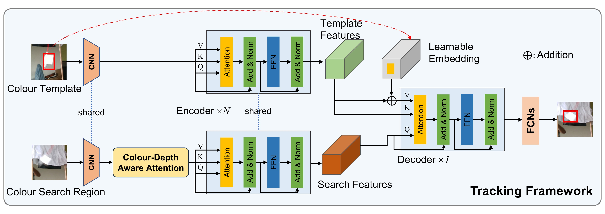

# CDAAT: Adaptiave Colour-Depth Aware Attention for RGB-D Object Tracking

The official PyTorch implementation of the CDAAT tracker: 


## Framework
The tracking pipeline is illustrated as:


The Colour-Depth Aware Attention Module is as:


## Usage

- ### Environment

Install the environment using Anaconda
```
conda create -n cdaat python=3.7
conda activate cdaat
sudo apt-get install libturbojpeg
bash install.sh
```

- ### Preparation

  - Clone our repository to your local project directory.
  - Download the training datasets ([LaSOT](http://vision.cs.stonybrook.edu/~lasot/download.html), [GOT-10k](http://got-10k.aitestunion.com/downloads), [TrackingNet](https://github.com/SilvioGiancola/TrackingNet-devkit), [COCO2017](https://cocodataset.org/#download), [RGBD1K](https://github.com/xuefeng-zhu5/RGBD1K) and [DepthTrack](https://github.com/xiaozai/DeT).
  - Prepare the test datasets ([CDTB](https://openaccess.thecvf.com/content_ICCV_2019/html/Lukezic_CDTB_A_Color_and_Depth_Visual_Object_Tracking_Dataset_and_ICCV_2019_paper.html), [RGBD1K](https://github.com/xuefeng-zhu5/RGBD1K) and [DepthTrack](https://github.com/xiaozai/DeT).
  - Edit the **PATH** in ```lib/test/evaluation/local.py``` and ```lib/train/adim/local.py``` to the proper absolute path.


- ### Training
The training process contains two stages:

  - 1st stage: train an RGB-only model (4 GPUS)

    ```
    export PYTHONPATH=/path/to/CDAAT:$PYTHONPATH
    python -m torch.distributed.launch --nproc_per_node=4  ./lib/train/run_training.py  --config baseline --save_dir /path/to/save/checkpoints
    ```
    or in single GPU:
    ```
    python ./lib/train/run_training.py --config baseline --save_dir /path/to/save/checkpoints
    ```

  - 2st stage: train an RGB-only model (4 GPUS). 

    You can download the 1st-stage pretrained [**model**](https://drive.google.com/file/d/14SceHb8mNYM39KMuei--x8jlKLJozFYY/view?usp=drive_link).

    Then, set the pretrained model path in ./experiments/cdaatrack/cdaatrack.yaml(MODEL.PRETRAINED).
    ```
    python -m torch.distributed.launch --nproc_per_node=4 ./lib/train/run_training.py  --config cdaatrack --save_dir /path/to/save/checkpoints
    ```


- ### Evaluation

Make sure you have prepared the trained model. You can train it by yourself or download from [Google Drive](https://drive.google.com/file/d/1lxPelslD2Cevvk5bD4r-jdT6ci4ny7LW/view?usp=drive_link).
Edit ./lib/test/evaluation/local.py and ./lib/test/parameter/cdaatrack.py to set the test set path and the pretrained model path, then run
```
python ./tracking/test.py
```
You can download the [raw results](https://drive.google.com/drive/folders/16umAls20MZGDcrUdyGN46OGMmeyV7H3E?usp=drive_link) from Google Drive, and evaluate the raw results using the [VOT toolkit](https://github.com/votchallenge/toolkit).
## Acknowledgement

Our idea is implemented base on the following projects. We really appreciate their wonderful open-source work!

- [AiATrack](https://github.com/Little-Podi/AiATrack) [[related paper](https://www.ecva.net/papers/eccv_2022/papers_ECCV/html/1951_ECCV_2022_paper.php)]
- [PyTracking](https://github.com/visionml/pytracking) [[related paper](https://arxiv.org/abs/1811.07628)]


## Contact

If you have any questions or concerns, please feel free to contact us.
